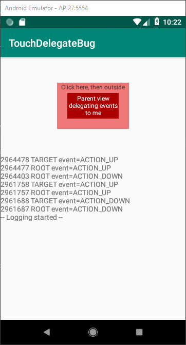

# TouchDelegate Bug

I noticed a bug related to Android's TouchDelegate class.
This repo was created to isolate the bug and to figure out how to battle it.

Later I found the issue on the Google's Issue Tracker:
https://issuetracker.google.com/issues/65295909

The issue is marked as fixed on Now 17, 2017. Nowadays (Fed 22, 2019) it's still not in production.

## The Problem

TouchDelegate continues forwarding ACTION_UP/ACTION_MOVE events after at least one ACTION_DOWN has been fired.

This happens because TouchDelegate's `mDelegateTargeted` flag is never being reset to `false`.



## Workaround

Don't use the root delegating view to handle some other events. Use it only for delegating events to `touchDelegate`.

```kotlin
rootView.setOnTouchListener { v, event ->
    v.touchDelegate!!.onTouchEvent(event)
}
```
